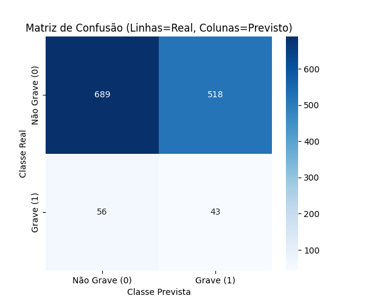
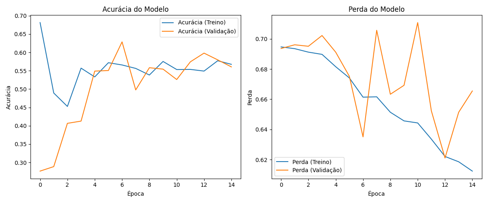

# Challenge Sprint 4 - Previsão de Acidentes com LSTMs (Case Sompo)

## 👥 Integrantes

- **Guilherme Gama Bitencourt Souza** | RM 565293  
- **Carolina Novakc Moraes** | RM 565621  

---

## 🧠 Descrição do Projeto

Este projeto faz parte do **Challenge da Sprint 4** do curso da FIAP, em parceria com a **Sompo Seguros**.  
O objetivo é **prever a probabilidade de ocorrência de acidentes graves** em um determinado período, utilizando **redes neurais recorrentes do tipo LSTM** (Long Short-Term Memory).

A análise foi focada na **rodovia BR-116**, uma das mais importantes e movimentadas do Brasil.

---

## 🎯 Objetivo

Desenvolver um modelo capaz de **identificar períodos de maior risco de acidentes graves**, com base em padrões históricos de acidentes.  
Essas previsões podem auxiliar seguradoras e órgãos de trânsito a **tomarem decisões preventivas** e **ajustarem políticas de segurança e cobertura de risco.**

---

## 🧩 Estrutura do Projeto

O pipeline implementado segue as seguintes etapas:

1. **Leitura e filtragem do dataset `datatran2025.csv`** (dados públicos de acidentes).  
2. **Criação da variável-alvo (`acidente_grave`)** — indica se houve ao menos um óbito (`mortos > 0`).  
3. **Combinação de data e hora em um índice temporal (`timestamp`).**  
4. **Limpeza e agregação de dados por hora** (`resample('h')`).  
5. **Codificação de variáveis categóricas e temporais (seno/cosseno cíclico).**  
6. **Criação de janelas temporais (`look_back=24`) para alimentar a LSTM.**  
7. **Treinamento e avaliação do modelo.**  
8. **Geração de relatórios e gráficos.**

---

## 🧰 Dependências

Antes de executar, instale as bibliotecas necessárias com:

```bash
pip install -r requirements.txt
```
Ou instale manualmente:

```bash
pip install pandas numpy scikit-learn tensorflow matplotlib seaborn
```

📂 Estrutura de Arquivos
```bash
├── datatran2025.csv                   # Dataset de entrada
├── modelo_acidente_grave_lstm.keras   # Modelo salvo após treinamento
├── matriz_confusao_acidente_grave.png # Matriz de confusão do modelo
├── curvas_treinamento.png             # Curvas de acurácia e perda
├── previsao_probabilidades_grave_ultimas_24h.png # Probabilidades previstas
└── main_lstm_acidentes.py             # Código principal do projeto
```

🚀 Como Executar o Projeto

1. Baixe ou clone o repositório

```bash
git clone https://github.com/guilhermegamabs/challenge-sprint-4-redes-neurais.git
cd challenge-sprint-4-redes-neurais
```

2. Garanta que o arquivo datatran2025.csv está na mesma pasta.
3. Execute os blocos de código

O script realizará automaticamente:

- **Filtragem dos dados da BR-116**

- **Preparação das features e do target**

- **Treinamento da rede LSTM**

- **Geração de relatórios e gráficos**

🧮 Estrutura da Rede Neural
```bash
Camada	Tipo	Neurônios	Observações
1	    LSTM	16	        Entrada sequencial (24h × N features)
2	    Dropout	0.3	        Reduz overfitting
3	    Dense	8	        Camada intermediária ReLU
4	    Dense	1	        Saída sigmoide (classificação binária)
```

📊 Resultados Gerados

Relatório de Classificação (Precision, Recall, F1-score)






🧠 Justificativa do Target

- **Target: acidente_grave (classe binária)**

- Critério: 1 se houver um ou mais mortos na hora → mortos > 0

- Motivação:

- Alta relevância para o setor de seguros.

- Impacto direto na precificação e risco de contratos.

- Baseia-se em evento raro, mas de alto custo.

⚙️ Principais Tecnologias

- Python 3.12

- TensorFlow / Keras

- Pandas / NumPy

- Scikit-Learn

- Matplotlib / Seaborn

🧾 Observações Finais

- A frequência temporal foi reamostrada para intervalos horários (1h).

- A normalização das features utilizou MinMaxScaler.

- O modelo foi ajustado com pesos de classe balanceados para lidar com desbalanceamento.

- O parâmetro look_back=24 indica que o modelo observa 24 horas anteriores para prever o risco na próxima hora.

🏁 Conclusão

- O modelo LSTM foi capaz de aprender padrões temporais de acidentes na BR-116, identificando períodos com maior probabilidade de ocorrência de acidentes graves.

- Esses insights podem apoiar estratégias de prevenção, melhorias em infraestrutura viária e decisões de seguros baseadas em risco real.